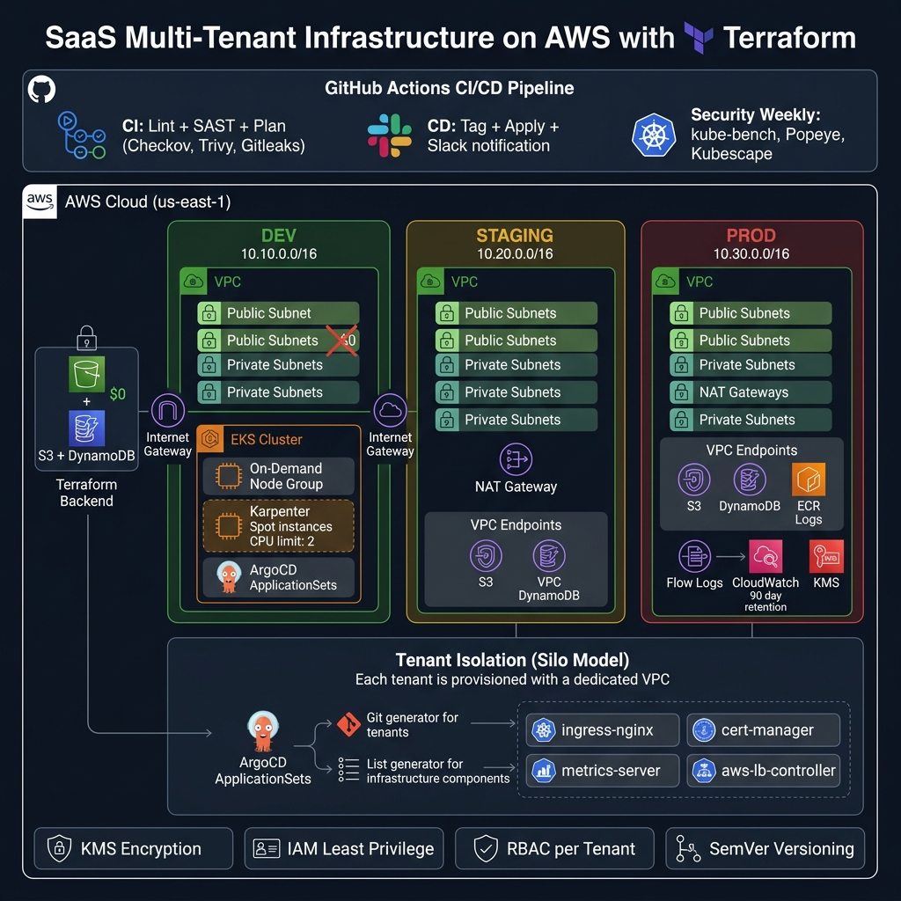

# 🏗️ Infraestrutura SaaS Multi-Tenant — AWS + Terraform + EKS + ArgoCD

<p align="center">
  
  
  
  
  
  
</p>

> 🇺🇸 [Read in English](README.md)

<p align="center">
  <b>Infraestrutura SaaS production-ready com isolamento total por tenant, GitOps, escalonamento inteligente e segurança em camadas.</b>
</p>

<p align="center">
  
</p>

---

## 📑 Índice

- [Visão Geral](#-visão-geral)
- [Arquitetura](#-arquitetura)
- [Estrutura do Projeto](#-estrutura-do-projeto)
- [Pré-Requisitos](#-pré-requisitos)
- [Quick Start](#-quick-start)
- [Documentação por Seção](#-documentação-por-seção)
- [Comparativo de Ambientes](#-comparativo-de-ambientes)
- [Pipeline CI/CD](#-pipeline-cicd)
- [Segurança](#-segurança)
- [FinOps — Otimização de Custos](#-finops--otimização-de-custos)
- [Versionamento SemVer](#-versionamento-semver)
- [Stack Tecnológica](#-stack-tecnológica)
- [Próximos Passos](#-próximos-passos)
- [Licença](#-licença)

---

## 🎯 Visão Geral

Este projeto implementa uma **infraestrutura SaaS multi-tenant completa na AWS** usando o modelo **Silo** (VPC dedicada por tenant). Cada tenant recebe seu próprio conjunto isolado de recursos:

| Camada | Tecnologia | Função |
|--------|-----------|--------|
| **Rede** | VPC + Subnets + NAT + Endpoints | Isolamento de rede L3 por tenant |
| **Compute** | EKS + Managed Node Groups | Kubernetes gerenciado pela AWS |
| **Escalonamento** | Karpenter (Spot + On-Demand) | Auto-scaling inteligente com otimização de custo |
| **GitOps** | ArgoCD + ApplicationSets | Deploy contínuo declarativo multi-tenant |
| **Estado** | S3 + DynamoDB | Backend remoto com state locking |
| **CI/CD** | GitHub Actions (3 workflows) | Plan, Apply, Security |
| **Segurança** | Checkov, Trivy, Gitleaks, kube-bench | SAST em PRs + DAST semanal |

### 🔑 Decisões-Chave

- **Modelo Silo**: Cada tenant recebe uma VPC dedicada → isolamento total, sem noisy neighbor
- **Módulos Reutilizáveis**: 3 módulos (`tenant-network`, `tenant-eks`, `tenant-argocd`) com contratos enxutos
- **Custo Progressivo**: Dev ~$108/mês (1 NAT) → Staging = balanceado → Prod = HA completa
- **GitOps Nativo**: ArgoCD com ApplicationSets gerencia apps de infra e de tenant automaticamente
- **Segurança em Camadas**: SAST em todo PR + DAST semanal no cluster

---

## 🏛️ Arquitetura

```
┌─────────────────────────────────────────────────────────────────────────────┐
│                              GITHUB ACTIONS                                │
│  ┌──────────┐  ┌───────────┐  ┌───────────┐  ┌──────────┐  ┌───────────┐  │
│  │ CI: Plan │  │ CD: Apply │  │  Security │  │ Infracost│  │ Tag/SemVer│  │
│  └────┬─────┘  └─────┬─────┘  └─────┬─────┘  └────┬─────┘  └─────┬─────┘  │
└───────┼──────────────┼──────────────┼──────────────┼──────────────┼────────┘
        │              │              │              │              │
        └──────────────┴──────────────┴──────────────┴──────────────┘
                                      │
                              ┌───────┴───────┐
                              │  AWS Account  │
                              │  (us-east-1)  │
                              └───────┬───────┘
                                      │
        ┌─────────────────────────────┼─────────────────────────────┐
        │                             │                             │
   ┌────┴────┐                  ┌─────┴────┐                 ┌─────┴────┐
   │   DEV   │                  │ STAGING  │                 │   PROD   │
   │ 10.10.x │                  │ 10.20.x  │                 │ 10.30.x  │
   │  2 AZs  │                  │  3 AZs   │                 │  3 AZs   │
   │ NAT: 1  │                  │ NAT: 1   │                 │ NAT: 3   │
   └────┬────┘                  └────┬─────┘                 └────┬─────┘
        │                            │                             │
   ┌────┴────────────┐    ┌──────────┴──────────┐    ┌─────────────┴────────┐
   │  EKS Cluster    │    │  EKS Cluster        │    │  EKS Cluster         │
   │  + Karpenter    │    │  + Karpenter         │    │  + Karpenter         │
   │  + ArgoCD       │    │  + ArgoCD            │    │  + ArgoCD            │
   │  CPU limit: 2   │    │  CPU limit: 100      │    │  CPU limit: 100      │
   │  Logs: api only │    │  Logs: api only      │    │  Logs: full (5 tipos)│
   │  KMS: ✅        │    │  KMS: ✅              │    │  KMS: ✅ + Flow Logs │
   └─────────────────┘    └─────────────────────┘    └──────────────────────┘
```

### Fluxo de Dados

```
Developer → Git Push → PR → CI (lint + SAST + plan)
                            ↓ merge
                         CD (tag + apply + Slack)
                            ↓
                    ArgoCD detecta mudanças
                            ↓
                   Sync automático nos pods
```

---

## 📁 Estrutura do Projeto

```
terraform-multi-tenant/
│
├── 📄 README.md                              ← Documentação principal (EN)
├── 📄 README.pt-br.md                        ← Você está aqui (PT-BR)
├── 📄 CODIGO_COMPLETO.txt                    ← Dump de referência do código
├── 📄 .gitignore                             ← Ignora .terraform, secrets, logs
│
├── 🔧 bootstrap/                            ← Setup inicial (rodar 1x)
│   ├── main.tf                               │  S3 bucket + DynamoDB table
│   └── provider.tf                            │  AWS provider us-east-1
│
├── 📦 modules/                               ← Módulos reutilizáveis
│   │
│   ├── 🌐 tenant-network/                   ← Módulo de Rede (8 arquivos)
│   │   ├── main.tf                            │  VPC + Internet Gateway
│   │   ├── variables.tf                       │  4 variáveis (contrato)
│   │   ├── subnets.tf                         │  Subnets públicas + privadas
│   │   ├── nat-gateway.tf                     │  NAT condicional (0, 1 ou N)
│   │   ├── routing.tf                         │  Route tables + associações
│   │   ├── endpoints.tf                       │  VPC Endpoints (Gateway + Interface)
│   │   ├── flow-logs.tf                       │  Flow Logs + IAM (só prod)
│   │   └── outputs.tf                         │  vpc_id, subnet_ids, nat_ids...
│   │
│   ├── ☸️  tenant-eks/                       ← Módulo EKS (8 arquivos)
│   │   ├── main.tf                            │  Cluster EKS + KMS + CloudWatch + SG
│   │   ├── variables.tf                       │  14 variáveis (contrato)
│   │   ├── providers.tf                       │  Provider kubectl (gavinbunney)
│   │   ├── iam.tf                             │  3 IAM Roles (cluster, node, karpenter)
│   │   ├── node-group.tf                      │  Node Group On-Demand principal
│   │   ├── karpenter.tf                       │  EC2NodeClass + NodePool + Subnet Tags
│   │   ├── wait-for-cluster.tf                │  Aguarda cluster ACTIVE + nodes READY
│   │   └── outputs.tf                         │  cluster_id, endpoint, ARNs...
│   │
│   └── 🔄 tenant-argocd/                    ← Módulo ArgoCD (9 arquivos)
│       ├── variables.tf                       │  9 variáveis (contrato)
│       ├── providers.tf                       │  Helm + Kubectl + Kubernetes
│       ├── version.tf                         │  Local infra_version
│       ├── namespace.tf                       │  Namespace argocd com labels
│       ├── helm-release.tf                    │  Helm release do ArgoCD
│       ├── values.yaml                        │  Values: RBAC, Ingress, Resources
│       ├── applicationsets.tf                 │  2 AppSets (tenants + infra)
│       ├── projects.tf                        │  2 AppProjects (infra + tenants)
│       └── outputs.tf                         │  namespace, server, appset names
│
├── 🌍 environments/                          ← Configurações por ambiente
│   ├── dev/                                   │  NAT habilitado, sem flow logs
│   │   ├── main.tf                            │  Orquestrador: network → EKS → ArgoCD
│   │   ├── variables.tf                       │  7 variáveis do ambiente
│   │   ├── terraform.tfvars                   │  10.10.0.0/16, 2 AZs, NAT=true
│   │   └── outputs.tf                         │  10 outputs
│   ├── staging/                               │  Balanceado: 1 NAT, endpoints básicos
│   │   ├── main.tf                            │  Apenas módulo network (por enquanto)
│   │   ├── variables.tf                       │  4 variáveis
│   │   ├── terraform.tfvars                   │  10.20.0.0/16, 3 AZs, NAT=1
│   │   └── outputs.tf                         │  4 outputs
│   └── prod/                                  │  HA: NAT por AZ, flow logs, endpoints
│       ├── main.tf                            │  Apenas módulo network (por enquanto)
│       ├── variables.tf                       │  4 variáveis
│       ├── terraform.tfvars                   │  10.30.0.0/16, 3 AZs, NAT=3
│       └── outputs.tf                         │  5 outputs
│
├── ⚙️  .github/workflows/                   ← Pipelines CI/CD
│   ├── ci.yml                                 │  CI unificado: fmt + lint + SAST + plan
│   ├── cd.yml                                 │  CD unificado: tag + apply + Slack
│   └── security-weekly.yml                    │  DAST semanal: kube-bench + Popeye
│
├── 📜 scripts/                               ← Scripts utilitários
│   ├── deploy.sh                              │  Deploy automatizado + kubeconfig
│   ├── setup-github.sh                        │  Prepara repo para primeiro push
│   └── version.sh                             │  Versionamento SemVer local
│
└── 📚 docs/                                  ← Documentação adicional
    ├── github-actions-setup.md                │  Guia: IAM OIDC + Secrets + Environments
    ├── bootstrap/README.md                    │  Doc: Backend S3/DynamoDB
    ├── modules/
    │   ├── tenant-network/README.md           │  Doc: Módulo de rede
    │   ├── tenant-eks/README.md               │  Doc: Módulo EKS
    │   └── tenant-argocd/README.md            │  Doc: Módulo ArgoCD
    ├── environments/README.md                 │  Doc: Ambientes dev/staging/prod
    ├── ci-cd/README.md                        │  Doc: Workflows GitHub Actions
    ├── scripts/README.md                      │  Doc: Scripts utilitários
    └── architecture/README.md                 │  Doc: Decisões de arquitetura
```

---

## ✅ Pré-Requisitos

| Ferramenta | Versão Mínima | Propósito |
|-----------|--------------|-----------| 
| [Terraform](https://www.terraform.io/) | `>= 1.6` | Provisionamento de infraestrutura |
| [AWS CLI](https://aws.amazon.com/cli/) | `v2` | Autenticação e configuração AWS |
| [kubectl](https://kubernetes.io/docs/tasks/tools/) | `1.29+` | Interação com o cluster EKS |
| [Helm](https://helm.sh/) | `3.x` | Instalação do ArgoCD |
| [Git](https://git-scm.com/) | `2.x` | Controle de versão |

### Conta AWS

- Conta AWS com permissões para criar: VPC, EKS, IAM, KMS, CloudWatch, S3, DynamoDB
- Credenciais configuradas: `aws configure` ou IAM Role via OIDC (CI/CD)

---

## 🚀 Quick Start

### Passo 1 — Bootstrap (executar apenas 1 vez)

Cria o backend remoto (S3 + DynamoDB) para armazenar o state do Terraform:

```bash
cd bootstrap
terraform init
terraform apply -auto-approve
```

> **O que cria:**
> - S3 Bucket `tfstate-saas-multi-tenant` (versionado, criptografado, bloqueio público)
> - DynamoDB Table `tfstate-lock` (state locking)

### Passo 2 — Deploy do Ambiente Dev

Você pode fazer o deploy do ambiente de desenvolvimento de forma manual ou automatizada:

#### Opção A: Deploy Automatizado (Recomendado para uso local)

Para executar o deploy e configurar automaticamente o seu arquivo de conexão `kubeconfig` local:

```bash
./scripts/deploy.sh
```

> O script executa `terraform init` + `terraform apply` no ambiente dev e, ao final, atualiza o `kubeconfig` local para acesso direto ao cluster EKS.

#### Opção B: Deploy Manual

1. Navegue para o diretório do ambiente:
   ```bash
   cd environments/dev
   ```
2. Inicialize o Terraform e aplique as configurações:
   ```bash
   terraform init
   terraform apply -auto-approve
   ```
3. Após a conclusão, atualize o seu `kubeconfig` local para obter acesso ao cluster:
   ```bash
   aws eks update-kubeconfig --region us-east-1 --name acme-corp-dev-eks
   ```

> ⚠️ **Tempo estimado:** ~20 a 30 minutos (o provisionamento do control plane do EKS, subida dos nós e ArgoCD levam tempo).
>
> **Dica:** Em caso de erro na primeira aplicação (comum devido a delays de propagação IAM na criação das roles do Kubernetes), aguarde 2 minutos e execute novamente.

### Passo 3 — Deploy de Staging/Prod

```bash
# Staging (balanceado — 1 NAT)
cd environments/staging
terraform init
terraform apply -auto-approve

# Prod (HA — NAT por AZ, flow logs)
cd environments/prod
terraform init
terraform apply -auto-approve
```

### Passo 4 — Destruir Recursos

```bash
# Destruir um ambiente específico
cd environments/dev && terraform destroy -auto-approve
```

---

## 📖 Documentação por Seção

Cada componente do projeto possui sua própria documentação detalhada:

| Seção | Link | Descrição |
|-------|------|-----------| 
| 🔧 Bootstrap | [docs/bootstrap/README.md](docs/bootstrap/README.md) | Backend S3 + DynamoDB, state locking, segurança |
| 🌐 Módulo Network | [docs/modules/tenant-network/README.md](docs/modules/tenant-network/README.md) | VPC, Subnets, NAT, Endpoints, Flow Logs |
| ☸️ Módulo EKS | [docs/modules/tenant-eks/README.md](docs/modules/tenant-eks/README.md) | Cluster EKS, Node Groups, Karpenter, IAM, KMS |
| 🔄 Módulo ArgoCD | [docs/modules/tenant-argocd/README.md](docs/modules/tenant-argocd/README.md) | ArgoCD, ApplicationSets, AppProjects, RBAC |
| 🌍 Environments | [docs/environments/README.md](docs/environments/README.md) | Dev, Staging, Prod — configurações e custos |
| ⚙️ CI/CD | [docs/ci-cd/README.md](docs/ci-cd/README.md) | Workflows: CI, CD, Security Weekly |
| 📜 Scripts | [docs/scripts/README.md](docs/scripts/README.md) | deploy.sh, setup-github.sh, version.sh |
| 🏛️ Arquitetura | [docs/architecture/README.md](docs/architecture/README.md) | Decisões de design, modelo Silo, FinOps |

---

## 📊 Comparativo de Ambientes

| Característica | Dev | Staging | Prod |
|:--------------|:---:|:-------:|:----:|
| **CIDR** | `10.10.0.0/16` | `10.20.0.0/16` | `10.30.0.0/16` |
| **AZs** | 2 | 3 | 3 |
| **Subnets (pub + priv)** | 2 + 2 | 3 + 3 | 3 + 3 |
| **NAT Gateway** | ✅ 1 (single) | ✅ 1 (single) | ✅ 3 (1 por AZ) |
| **VPC Endpoints Gateway** | ✅ S3 + DynamoDB | ✅ S3 + DynamoDB | ✅ S3 + DynamoDB |
| **VPC Endpoints Interface** | ❌ | ❌ | ✅ ECR + Logs |
| **Flow Logs** | ❌ | ❌ | ✅ (90 dias) |
| **EKS Endpoint** | Público | Público | Privado |
| **EKS Logs** | `api` | `api` | 5 tipos (full) |
| **CloudWatch Retenção** | 7 dias | 7 dias | 90 dias |
| **Karpenter CPU Limit** | 2 vCPU | 100 vCPU | 100 vCPU |
| **KMS Encryption** | ✅ | ✅ | ✅ |
| **CD Deploy** | Automático | Approval manual | Approval + Freeze |
| **Custo estimado/mês** | ~$108 | ~$150 | ~$500+ |

> **Nota:** O ambiente Dev utiliza NAT Gateway (single) porque os nós do EKS em subnets privadas precisam de acesso à internet para se registrar no control plane e baixar imagens de container.

---

## 🔄 Pipeline CI/CD

```
                    ┌────────────────────────────────┐
                    │       Developer cria PR         │
                    └──────────────┬─────────────────┘
                                   │
                    ┌──────────────▼─────────────────┐
                    │   CI Workflow (ci.yml)          │
                    │                                 │
                    │  1. terraform fmt -check        │
                    │  2. tflint (lint)               │
                    │  3. Checkov (IaC scan)          │
                    │  4. Trivy (vuln + secrets)      │
                    │  5. Gitleaks (secrets scan)     │
                    │  6. terraform plan (por env)    │
                    │  7. Comentário no PR            │
                    └──────────────┬─────────────────┘
                                   │ merge
                    ┌──────────────▼─────────────────┐
                    │   CD Workflow (cd.yml)          │
                    │                                 │
                    │  1. Calcula SemVer tag          │
                    │  2. Cria Git Tag automática     │
                    │  3. terraform apply (por env)   │
                    │  4. Notifica Slack              │
                    └────────────────────────────────┘

                    ┌────────────────────────────────┐
                    │ Security Weekly (domingo 8h)   │
                    │                                 │
                    │  1. kube-bench (CIS)            │
                    │  2. Popeye (sanidade cluster)   │
                    │  3. Kubescape (NSA/CISA)        │
                    └────────────────────────────────┘
```

---

## 🔒 Segurança

### SAST (Análise Estática — em todo PR)

| Ferramenta | Escopo | Formato |
|-----------|--------|---------|
| **Checkov** | Misconfigurações de IaC | SARIF → GitHub Security |
| **Trivy** | Vulnerabilidades + secrets | SARIF → GitHub Security |
| **Gitleaks** | Secrets no código/histórico | GitHub native |
| **TFLint** | Boas práticas Terraform | Compact |

### DAST (Análise Dinâmica — semanal)

| Ferramenta | Escopo | Quando |
|-----------|--------|--------|
| **kube-bench** | CIS Kubernetes Benchmark | Domingo 8h UTC |
| **Popeye** | Sanidade geral do cluster | Domingo 8h UTC |
| **Kubescape** | Framework NSA/CISA | Domingo 8h UTC |

### Camadas de Proteção

- **Rede**: VPC isolada por tenant, Security Groups, VPC Endpoints (sem tráfego público)
- **Secrets**: KMS Key com rotação automática para criptografia de secrets do EKS
- **IAM**: 3 Roles com mínimo privilégio (cluster, node, karpenter)
- **RBAC**: ArgoCD AppProjects com restrições por tenant
- **Endpoint**: Em prod, API server EKS é privado (sem acesso público)

---

## 💰 FinOps — Otimização de Custos

| Estratégia | Impacto | Onde |
|-----------|---------|------|
| **NAT condicional** | ~$33/mês por NAT (dev usa 1, prod usa 3) | `tenant-network` |
| **VPC Endpoints Gateway** | Grátis (S3/DynamoDB) | Todos ambientes |
| **Endpoints Interface só em prod** | ~$20/mês cada | `endpoints.tf` |
| **Flow Logs só em prod** | ~$5/mês | `flow-logs.tf` |
| **Karpenter Spot** | 60-90% economia em nodes | `karpenter.tf` |
| **Karpenter Consolidation** | Remove nós ociosos | `WhenUnderutilized` |
| **CPU Limit em dev** | Máx 2 vCPU | `karpenter.tf` |
| **CloudWatch 7d em dev** | Reduz custo de logs | `main.tf` EKS |
| **Tags de CostCenter** | Visibilidade por tenant | Todos recursos |
| **Infracost em PRs** | Preview de custo antes do merge | `ci.yml` |

---

## 🏷️ Versionamento SemVer

O projeto usa **Semantic Versioning** automático:

```bash
# Ver versão atual
./scripts/version.sh current

# Ver próxima versão
./scripts/version.sh next

# Criar e enviar tag
./scripts/version.sh tag
```

No CI/CD, a tag é criada automaticamente no merge para `main` e passada como `TF_VAR_infra_version` para o `terraform apply`.

---

## 🛠️ Stack Tecnológica

| Categoria | Tecnologias |
|----------|-------------|
| **IaC** | Terraform >= 1.6 |
| **Cloud** | AWS (VPC, EKS, IAM, KMS, S3, DynamoDB, CloudWatch) |
| **Kubernetes** | EKS 1.31, Karpenter v1 (Spot + On-Demand) |
| **GitOps** | ArgoCD 7.8.0 com ApplicationSets |
| **CI/CD** | GitHub Actions (3 workflows) |
| **SAST** | Checkov, Trivy, TFLint, Gitleaks |
| **DAST** | kube-bench, Popeye, Kubescape |
| **Providers** | AWS ~> 5.0, Helm ~> 2.17, Kubernetes ~> 2.35, Kubectl ~> 1.14 |
| **Backend** | S3 + DynamoDB (state locking) |

---

## 📊 Próximos Passos

Para tornar a infraestrutura SaaS completa, os próximos módulos seriam:

| # | Módulo | Descrição |
|---|--------|-----------| 
| 1 | `modules/tenant-compute` | ECS Fargate + ECR por tenant |
| 2 | `modules/tenant-database` | Aurora PostgreSQL / DynamoDB com `tenant_id` |
| 3 | `modules/tenant-auth` | Cognito User Pool + tenant claim no JWT |
| 4 | `modules/tenant-monitoring` | CloudWatch Dashboard por tenant |
| 5 | `modules/control-plane` | API Gateway + Lambda para onboarding de tenants |
| 6 | `modules/tenant-billing` | AWS Budgets + Cost Tags por tenant |

---

## 📄 Licença

Este projeto é open source e livre para uso educacional e profissional.

---

<p align="center">
  <i>"Um DevOps Sênior não é quem sabe tudo de cabeça.<br>
  É quem sabe as perguntas certas a fazer e como validar cada passo antes de prosseguir."</i>
</p>
