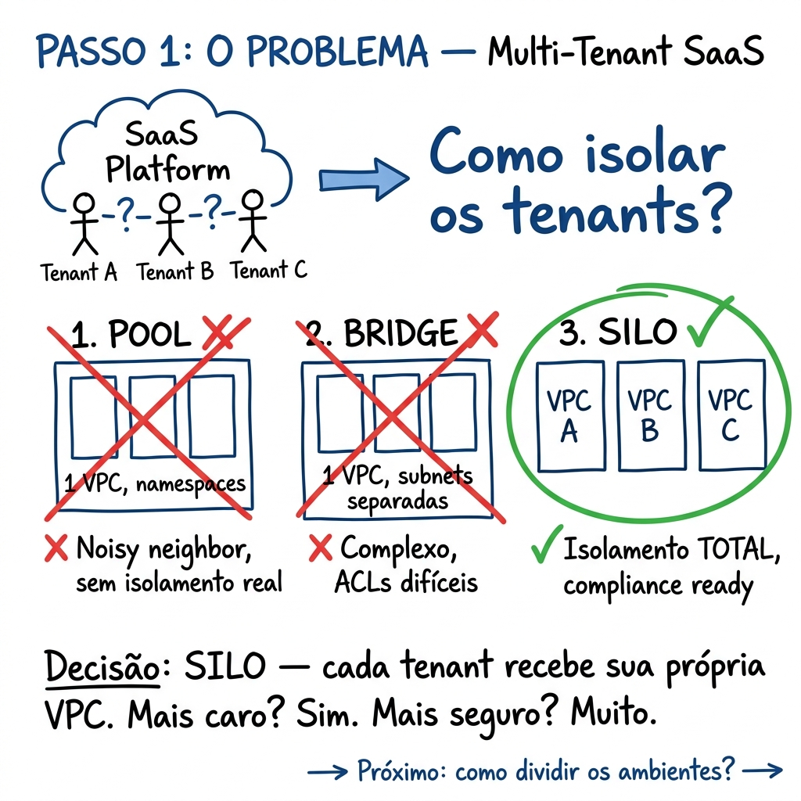
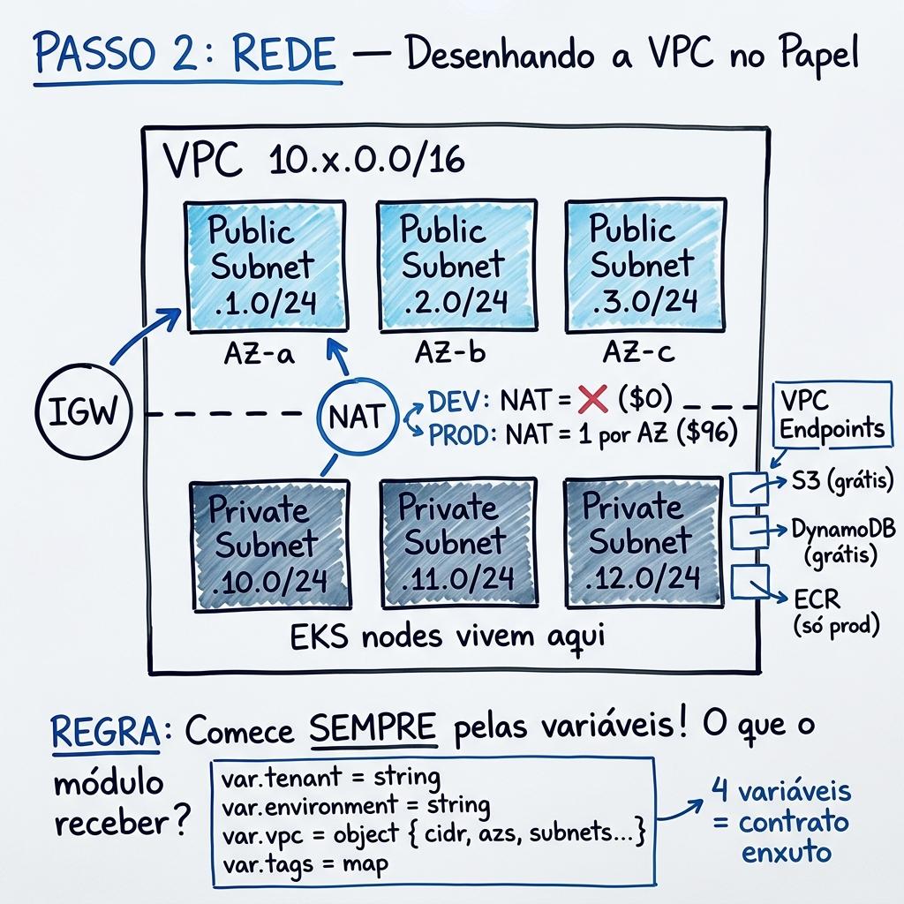
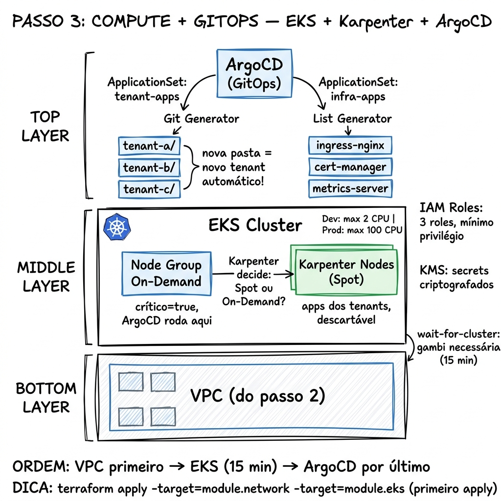
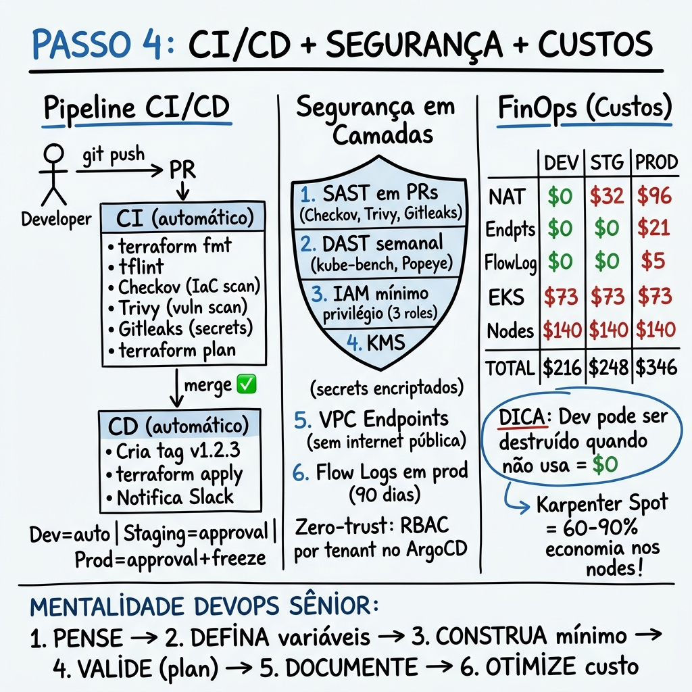

# 🏛️ Architecture Decisions

[← Back to main README](../../README.md)

---

## 📋 Overview

This document explains the **design decisions** behind the project. Each decision includes: the problem, the alternatives evaluated, the choice made, and the justification.

<p align="center">
  
</p>

---

## 1. Multi-Tenant Model: Silo (Dedicated VPC)

### Problem

How to isolate tenants in a SaaS platform on AWS?

### Alternatives

| Model | Description | Isolation | Cost | Complexity |
|--------|-----------|:----------:|:-----:|:------------:|
| **Pool** | All tenants in the same VPC, separated by namespace | 🟡 Low | 💚 Minimum | 🟡 Medium |
| **Bridge** | Shared VPC with subnets separated per tenant | 🟡 Medium | 🟡 Medium | 🟡 Medium |
| **Silo** | Dedicated VPC per tenant | 🟢 Total | 🔴 High | 🟢 Simple |

### Choice: **Silo**

### Justification

- **Total network isolation**: No traffic between tenants is possible (even by accident)
- **No noisy neighbors**: One tenant does not affect the performance of another
- **Independent auditing**: Flow logs, VPC endpoints, and IAM per tenant
- **Onboarding/Offboarding**: Adding or removing a tenant = creating or destroying a module
- **Compliance**: SOC2/HIPAA/PCI-DSS require strong isolation

### Trade-offs

- ❌ Higher cost (each VPC has its own NATs, endpoints, etc.)
- ❌ More resources to manage
- ✅ Mitigated by per-environment optimization (dev without NAT = $0)

---

## 2. File Structure: One File per Responsibility

### Problem

How to organize Terraform files so that `main.tf` doesn't end up with 500+ lines?

### Alternatives

| Approach | Description |
|-----------|-----------|
| **Monolithic** | Everything in `main.tf` |
| **Per resource** | One file per resource type (`vpc.tf`, `subnet.tf`, `igw.tf`) |
| **Per responsibility** | One file per area of responsibility (`routing.tf`, `endpoints.tf`) |

### Choice: **Per Responsibility**

### Result

```
modules/tenant-network/
├── main.tf           # VPC + IGW (36 lines)
├── subnets.tf        # Pub + priv subnets (33 lines)
├── nat-gateway.tf    # EIP + NAT (29 lines)
├── routing.tf        # Route tables + associations (53 lines)
├── endpoints.tf      # VPC Endpoints (105 lines)
├── flow-logs.tf      # Flow Logs + IAM (80 lines)
├── variables.tf      # 4 variables (29 lines)
└── outputs.tf        # 8 outputs (33 lines)
```

### Justification

- **Maximum ~105 lines per file** → Facilitates code review
- **File name = responsibility** → You know where to look
- **Minimizes Git conflicts** → Parallel teams edit different files
- **Facilitates onboarding** → A new dev understands the structure immediately

---

## 3. Variables: Lean Contract with `object`

### Problem

How many variables should a module receive? How to avoid "variable explosion"?

### Alternatives

| Approach | Variables | Example |
|-----------|:---------:|---------|
| **Flat** | ~15 | `var.cidr`, `var.azs`, `var.public_subnets`, `var.enable_nat`... |
| **Object** | ~4 | `var.vpc.cidr`, `var.vpc.azs`, `var.vpc.enable_nat_gateway`... |

### Choice: **Object with Optional**

```hcl
variable "vpc" {
  type = object({
    cidr               = string
    azs                = list(string)
    public_subnets     = list(string)
    private_subnets    = list(string)
    enable_nat_gateway = optional(bool, true)    # ← Smart default
    single_nat_gateway = optional(bool, true)
  })
}
```

### Justification

- **4 variables in the network module** (vs 15+ in the flat model)
- **Semantic grouping** → All VPC configs are grouped together
- **Smart defaults** → `optional(bool, true)` = works without configuration
- **Strong typing** → Error at `plan` time, not `apply`
- **Autocomplete** → IDEs show the object fields

---

## 4. Conditional NAT Gateway

### Problem

A NAT Gateway costs ~$32/month fixed + $0.045/GB of traffic. In dev, this is unnecessary.

### Decision

```hcl
count = var.vpc.enable_nat_gateway ? (
  var.vpc.single_nat_gateway ? 1 : length(local.azs)
) : 0
```

| Environment | NAT | Estimated Cost |
|---------|:---:|:--------------:|
| Dev | ❌ (0 NATs) | $0/month |
| Staging | ✅ (1 NAT) | ~$32/month |
| Prod | ✅ (3 NATs) | ~$96/month |

### Impact in Dev

Without NAT, resources in private subnets **cannot access the internet**. Consequences:
- ❌ Pods cannot pull images from public registries
- ❌ Nodes cannot download updates
- ✅ VPC Gateway Endpoints (S3, DynamoDB) keep working
- ✅ Works for basic testing with EKS

### When to enable NAT in dev?

If pods need to access external APIs or pull images from Docker Hub, change `enable_nat_gateway = true` in `terraform.tfvars`.

---

## 5. VPC Endpoints: Free Gateway vs Paid Interface

### Problem

VPC Interface Endpoints cost ~$7-20/month each. In dev/staging, this is not justified.

### Decision

| Endpoint | Type | Dev | Staging | Prod | Cost |
|---------|------|:---:|:-------:|:----:|:-----:|
| S3 | Gateway | ✅ | ✅ | ✅ | $0 |
| DynamoDB | Gateway | ✅ | ✅ | ✅ | $0 |
| ECR API | Interface | ❌ | ❌ | ✅ | ~$7/month |
| ECR Docker | Interface | ❌ | ❌ | ✅ | ~$7/month |
| CloudWatch Logs | Interface | ❌ | ❌ | ✅ | ~$7/month |

### Justification

- **Gateway Endpoints are FREE** → Always enabled
- **Interface Endpoints are paid** → Only in prod where security and performance are critical
- In prod, ECR endpoints prevent image pulls from going through the NAT (saving $0.045/GB)
- In prod, Logs endpoint ensures logs ensures logs arrive even without internet access

---

## 6. Karpenter vs Cluster Autoscaler

### Problem

How to scale nodes automatically in EKS?

### Alternatives

| Tool | Approach | Speed | Cost |
|-----------|-----------|:-----:|:-----:|
| **Cluster Autoscaler** | Reacts to pending pods, adds ASG nodes | 🟡 ~2-5 min | 🟡 |
| **Karpenter** | Evaluates workloads, provisions optimized instances | 🟢 ~30s-1 min | 🟢 |

### Choice: **Karpenter**

### Justification

- **30s vs 3min** → Karpenter provisions nodes 3-5x faster
- **Spot + On-Demand** → Automatic mix to optimize cost
- **Consolidation** → Automatically removes underutilized nodes
- **Instance diversity** → Chooses from 6 instance families
- **CPU Limit** → Controls maximum spend (2 vCPU in dev, 100 in prod)
- **Recycling** → Nodes are rotated every 30 days (security)

### Backup

The ArgoCD ApplicationSet also installs `cluster-autoscaler` as a fallback in case Karpenter fails.

---

## 7. ArgoCD ApplicationSets: Git vs List Generator

### Problem

How to manage application deployments for tenants and infrastructure?

### Decision

| ApplicationSet | Generator | Purpose |
|---------------|-----------|-----------|
| `tenant-apps` | **Git** (directories) | Detects folders under `tenants/*` |
| `infra-apps` | **List** (static) | Infrastructure components with fixed versions |

### Why Git Generator for tenants?

```
# Onboarding a new tenant:
# 1. Create tenants/new-tenant/ folder in the repo
# 2. Add K8s manifests
# 3. Push → ArgoCD automatically detects
# 4. Application created → Automatic deploy
```

**Zero manual configuration** for new tenants!

### Why List Generator for infra?

Infrastructure components need **controlled versions** (cannot be "latest"):

```yaml
- name: ingress-nginx
  version: 4.12.0    # ← Fixed, controlled version
- name: cert-manager
  version: 1.17.0
```

Updating version = edit the list → PR → Review → Merge → Deploy.

---

## 8. AppProjects: Zero-Trust between Tenants and Infra

### Problem

How to prevent one tenant from accessing or modifying another's resources?

### Decision

```
┌─── AppProject: infra ──────────────────┐
│ ✅ Repos: Official Helm charts         │
│ ✅ Namespaces: ingress, cert-mgr, etc. │
│ ✅ Cluster resources: all              │
│ ❌ Access to tenant repos              │
└─────────────────────────────────────────┘

┌─── AppProject: tenants ────────────────┐
│ ✅ Repo: github.com/${tenant}           │
│ ✅ Namespaces: * (any)                 │
│ ✅ Cluster resources: Namespace, Quota  │
│ ❌ CRDs, ClusterRoles, etc.             │
└─────────────────────────────────────────┘
```

### Justification

- **Least privilege** → Tenants cannot create CRDs or ClusterRoles
- **Repo isolation** → Each project only accesses its authorized repos
- **ResourceQuota/LimitRange** → Tenants can limit their own namespaces
- **Orphaned resources** → ArgoCD warns about orphaned resources

---

## 9. IAM: Least Privilege with 3 Roles

### Problem

How many IAM Roles does EKS need and with which permissions?

### Decision

| Role | Assumed by | Permissions |
|------|-----------|-----------|
| **Cluster** | `eks.amazonaws.com` | `EKSClusterPolicy` + `VPCResourceController` |
| **Node** | `ec2.amazonaws.com` | `WorkerNode` + `CNI` + `ECR` + `SSM` |
| **Karpenter** | `ec2.amazonaws.com` | Node policies + Custom EC2 (conditional) |

### Why SSM instead of SSH?

| SSH | SSM |
|:---:|:---:|
| Needs to open port 22 | No open ports |
| Manage `.pem` keys | Keyless |
| Permissive Security Group | No additional SG |
| No native auditing | Native CloudTrail |

---

## 10. Wait-for-Cluster: "Necessary Workaround"

### Problem

Terraform creates the EKS cluster and **immediately** tries to apply manifests (Karpenter, ArgoCD). But the cluster is not yet operational (~15 min).

### Alternatives

| Approach | Pros | Cons |
|-----------|------|---------|
| **Separate into 2 applies** | Simple | Manual, error-prone |
| **`depends_on` only** | Native | Does not wait for cluster to become ACTIVE |
| **`null_resource` with wait** | Real wait | "Workaround" (local-exec provisioner) |

### Choice: **null_resource with local-exec**

```hcl
resource "null_resource" "wait_for_cluster" {
  provisioner "local-exec" {
    command = <<EOF
      aws eks wait cluster-active --name ${cluster}
      # Node polling: up to 5 minutes
    EOF
  }
}
```

### Justification

- Without this wait, `terraform apply` **always fails** the first time
- Native `depends_on` does not know how to wait for ACTIVE status
- It is a "documented workaround" — the comment in the code explains exactly why it exists
- A native alternative (Terraform wait condition) does not exist for EKS

---

## 11. Versioning: Automatic SemVer in CI/CD

### Problem

How to track which version of the infrastructure created each resource?

### Decision

```
Git tag (SemVer) → TF_VAR_infra_version → Labels/Annotations on resources
```

| Step | What happens |
|-------|---------------|
| Merge to main | CD calculates next version (patch increment) |
| Git tag | `v1.2.4` created and pushed |
| terraform apply | `TF_VAR_infra_version=v1.2.4` |
| ArgoCD Namespace | Label: `infra-version: v1.2.4` |

### Benefits

- **Traceability**: "Which version created this namespace?" → `kubectl get ns argocd -o yaml`
- **Rollback**: If v1.2.4 broke, roll back to v1.2.3
- **Audit**: Git tags work as release notes

---

## 12. FinOps: Cost as an Architecture Variable

### Philosophy

> "Cost is not a later optimization. It is an architecture decision."

### FinOps Decisions

| Decision | Savings | Where |
|---------|:--------:|------|
| Conditional NAT | $0-96/month | `nat-gateway.tf` |
| Gateway endpoints (free) | $0 | `endpoints.tf` |
| Interface endpoints only in prod | ~$21/month | `endpoints.tf` |
| Flow logs only in prod | ~$5/month | `flow-logs.tf` |
| Karpenter Spot instances | 60-90% | `karpenter.tf` |
| Karpenter consolidation | Variable | `karpenter.tf` |
| CPU limit in dev (2 vCPU) | Unlimited | `karpenter.tf` |
| CloudWatch 7d in dev | Variable | EKS `main.tf` |
| Minimal EKS logs in dev | ~$5/month | EKS `main.tf` |
| CostCenter tags | Visibility | All resources |
| Infracost preview in PRs | Prevention | `ci.yml` |

### Estimated Cost per Environment

| Component | Dev | Staging | Prod |
|-----------|:---:|:-------:|:----:|
| VPC/Subnets | $0 | $0 | $0 |
| NAT Gateway | $0 | ~$32 | ~$96 |
| VPC Endpoints | $0 | $0 | ~$21 |
| Flow Logs | $0 | $0 | ~$5 |
| EKS Control Plane | ~$73 | ~$73 | ~$73 |
| Node Group (2x m6i.large) | ~$140 | ~$140 | ~$140 |
| KMS Key | ~$1 | ~$1 | ~$1 |
| CloudWatch Logs | ~$2 | ~$2 | ~$10 |
| **TOTAL** | **~$216** | **~$248** | **~$346** |

> **Note:** Dev can be destroyed when not in use → $0.
> Staging without EKS = ~$32/month. Prod without EKS = ~$122/month.

---

## 🧠 Summary: How a Senior DevOps Thinks

```
1. THINK     → Draw the architecture on paper
2. DEFINE    → Variables first (the contract)
3. BUILD     → Minimum viable, iteratively
4. VALIDATE  → terraform plan at every step
5. DOCUMENT  → While building, not after
6. OPTIMIZE  → Cost only when the basic structure works
```

> *"A Senior DevOps is not someone who knows everything off the top of their head.
> It's someone who knows the right questions to ask and how to validate
> each step before moving forward."*

---

## 🎨 Visual Guide: Drawing on Paper (4 Steps)

If you were to draw this architecture on paper/whiteboard, this would be the reasoning:

### Step 1 — The Problem: How to Isolate Tenants?

<p align="center">
  
</p>

> Before writing any code, define the **isolation model**. Pool, Bridge, or Silo? Evaluate the cost vs security trade-offs. In this project: **Silo** (dedicated VPC per tenant).

---

### Step 2 — Network: Drawing the VPC

<p align="center">
  
</p>

> Draw the VPC with public and private subnets. Decide: NAT yes or no? Free or paid endpoints? **ALWAYS start with the variables** — the module's contract. 4 variables = lean contract.

---

### Step 3 — Compute + GitOps: EKS + Karpenter + ArgoCD

<p align="center">
  
</p>

> Think in layers: VPC (base) → EKS (middle) → ArgoCD (top). On-Demand Node Group for critical workloads, Karpenter Spot for the rest. ApplicationSets: **new folder in Git = automatic new tenant**.

---

### Step 4 — CI/CD + Security + Costs

<p align="center">
  
</p>

> Three final pillars: **Pipeline** (CI on PRs, CD on merge), **Layered Security** (SAST + DAST + IAM + KMS), **FinOps** (conditional NAT, Spot, CPU limits). Dev can be $0 when destroyed.

---

[← Back to main README](../../README.md)
